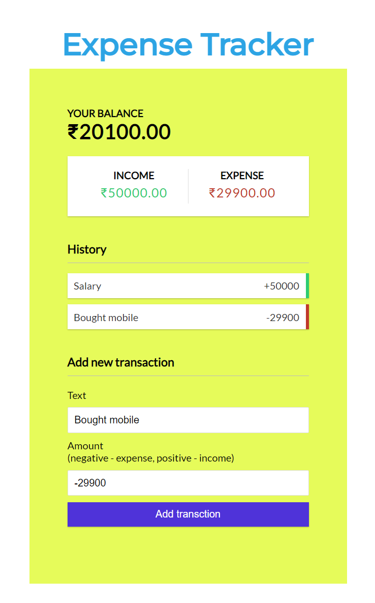

# Expense Tracker

`Author:` Padmanabh Belavadi

This is the project based on the idea of `Tracking of daily wages`.
Here we can add the name of the expense and how much money it cost. 
and we can add and new income / income source to it...
while we spending amount for something the amount will be deducted from the income.
__all the transcations are strored in localstorage__

## My Project Looks Like :

## Reach Me Out on

 [Linkedin](https://www.linkedin.com/in/padmanabh-belavadi)

 [GitHub](https://github.com/padmanabh-b)

 [Instagram](https://www.instagram.com/legend_padmanabh/)

 [Findcoder](https://www.findcoder.io/u/padmanabh_b)

## Deployed Link
[Expense Tracer | Live ](https://paddu-expense-tracker.netlify.app/)
